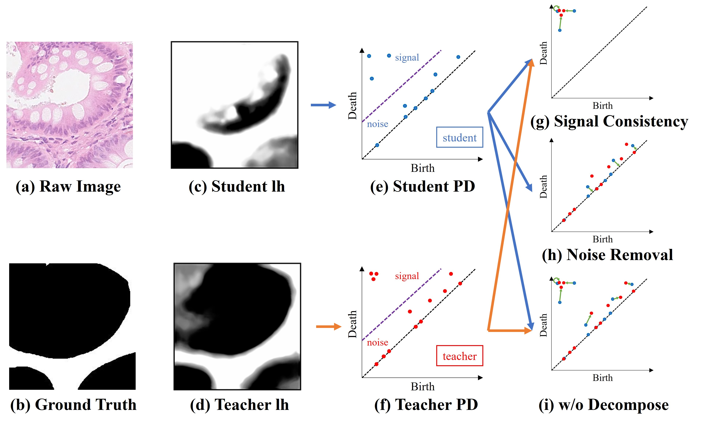
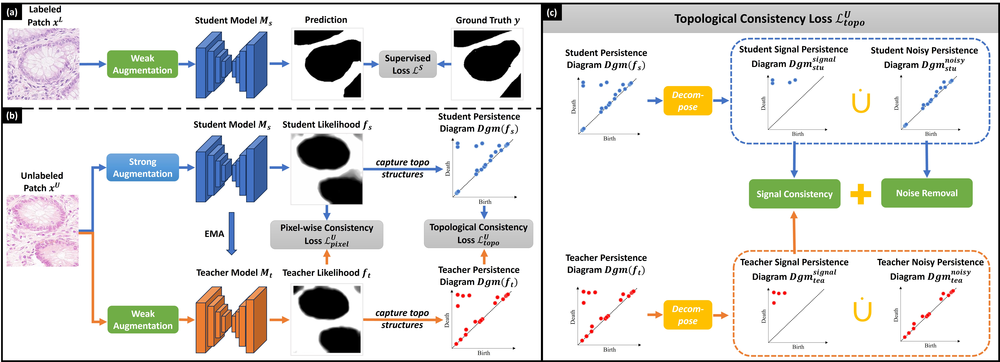
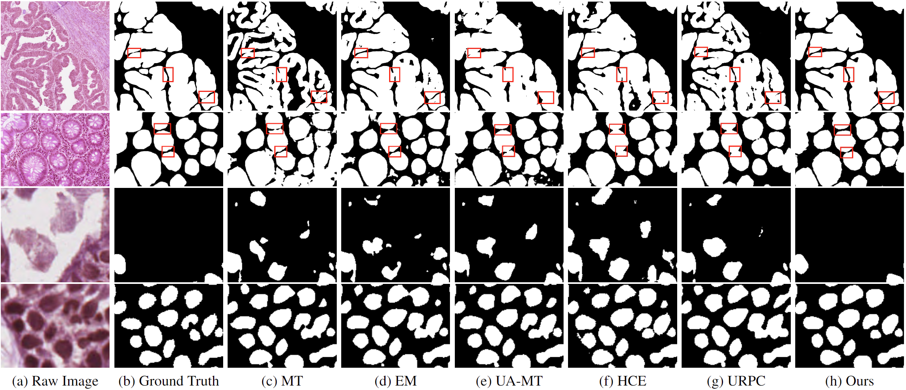

# [TopoSemiSeg: Enforcing Topological Consistency for Semi-Supervised Segmentation of Histopathology Images](https://arxiv.org/abs/2311.16447)
The official implementation of "TopoSemiSeg: Enforcing Topological Consistency for Semi-Supervised Segmentation of Histopathology Images".

## Environment
Training and evaluation environment: Python 3.9.12, PyTorch 2.0.1, CUDA 11.7.
We use CubicalRipser (cripser) to extract topological features.
Run the following command to install required packages.
```
pip install -r requirements.txt
```

## Inituition of Decomposition & Matching
<p align="center">
  
</p>

## Overall Framework
<p align="center">
  
</p>

## Usage
This loss can be incorporated into any teacher-student framework or its variants.

Sample usage: note that we calculate the topological consistency loss between the foreground of the likelihood map.

```python
def calculate_topo_loss(likelihood, target):
  batch_size = likelihood.shape[0]
  
  topo_loss = 0.0
  
  for i in range(batch_size):
      lh = likelihood[i]
      #print(lh.shape)
      gt = target[i]

      topo_loss += getTopoLoss(lh, gt)
  
  topo_loss /= batch_size
  return topo_loss

topo_loss_weight = 0.002
stu_likelihood = torch.softmax(model(unlabeled_data))[:,1,:,:]
tea_likelihood = torch.softmax(teacher_model(unlabeled_data))[:,1,:,:]

topo_consistency_loss = calculate_topo_loss(stu_likelihood, tea_likelihood)
topo_consistency_loss = topo_loss_weight*topo_consistency_loss
```
  

## Qualitative Results
<p align="center">
  
</p>

## Citation
```bibtex
@InProceedings{xu2023toposemiseg,
    author    = {Xu, Meilong and Hu, Xiaoling and Gupta, Saumya and Abousamra, Shahira and Chen, Chao},
    title     = {TopoSemiSeg: Enforcing Topological Consistency for Semi-Supervised Segmentation of Histopathology Images},
    journal   = {arXiv},
    year      = {2023},
    volume    = {abs/2311.16447},
}
